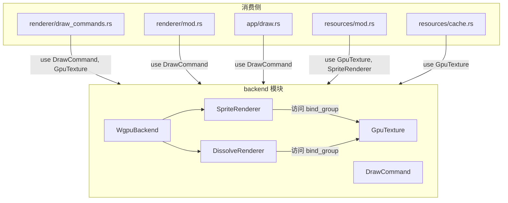
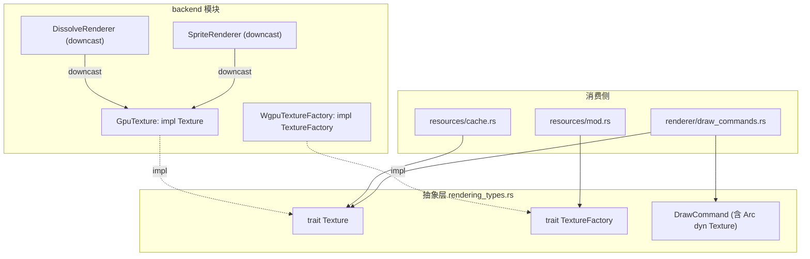

# RFC: RenderBackend Trait -- 渲染后端抽象层

## 元信息

- 编号：RFC-008
- 状态：Implemented
- 作者：Ring-rs 开发组
- 日期：2026-03-11
- 影响范围：`host`（`backend/`、`renderer/`、`resources/`）
- 前置：RFC-007（macroquad -> winit + wgpu + egui 迁移，已完成）

---

## 1. 背景

RFC-007 将渲染后端从 macroquad 迁移到 winit + wgpu + egui，解决了窗口封闭和 GPU 管线不可控的问题。迁移完成后，`host` 的核心渲染管线已稳定运行。

但当前实现中，**wgpu 具体类型从 `backend/` 模块泄漏到了 `renderer/` 和 `resources/` 模块**，造成两个问题：

### 1.1 紧耦合

以下模块直接依赖 `backend/` 中的 wgpu 封装类型：

| 消费模块 | 依赖的 backend 类型 | 用途 |
|----------|---------------------|------|
| `renderer/mod.rs` | `DrawCommand` | 构建并返回绘制命令列表 |
| `renderer/draw_commands.rs` | `DrawCommand`, `GpuTexture` | 生成 Sprite/Rect/Dissolve 命令 |
| `app/draw.rs` | `DrawCommand` | 传递绘制命令到 backend |
| `resources/mod.rs` | `GpuTexture`, `SpriteRenderer` | 创建纹理 |
| `resources/cache.rs` | `GpuTexture` | 缓存纹理、估算显存 |

其中 `GpuTexture` 内部持有 `wgpu::Texture`、`wgpu::TextureView`、`wgpu::BindGroup` 等 wgpu 原生类型；`GpuResourceContext` 持有 `Arc<wgpu::Device>`、`Arc<wgpu::Queue>`、`Arc<SpriteRenderer>`。这意味着上述消费模块在编译层面与 wgpu 绑定。

### 1.2 不可测

`docs/coverage.md` 明确提出 host 应关注"关键链路的 headless 测试与可测试边界"。但当前以下场景无法在无 GPU 环境下测试：

- `Renderer::build_draw_commands()` 的 draw command 生成逻辑（需要 `Arc<GpuTexture>` 才能构造测试输入）
- `ResourceManager::load_texture()` 的完整加载流程（需要真实 GPU 上下文）
- `CommandExecutor` 到渲染状态更新的集成链路

### 1.3 当前依赖关系



---

## 2. 目标与非目标

### 2.1 目标

- **G1** -- 定义 `Texture` trait 和 `TextureFactory` trait，将 `renderer/` 和 `resources/` 与 wgpu 具体类型解耦
- **G2** -- 提供 `NullBackend`（headless 后端），支持无 GPU 环境下的单元测试和集成测试
- **G3** -- 保持 Runtime/Host 架构分离不变（`vn-runtime` 零改动）
- **G4** -- 迁移完成后，现有所有渲染功能行为等价

### 2.2 非目标

- **不**在本 RFC 实现多渲染后端（OpenGL/Vulkan/WebGL 等）
- **不**改动 `vn-runtime`
- **不**改动 `rodio` 音频系统
- **不**改动 egui UI 层（egui 渲染仍由 `WgpuBackend` 内部处理）
- **不**引入 `RenderBackend` trait 来抽象整个 backend（本 RFC 聚焦纹理和绘制命令的抽象）

---

## 3. 纹理抽象方案对比

### 3.1 方案 A：Trait Object (`Arc<dyn Texture>`)

```rust
pub trait Texture: Send + Sync + std::fmt::Debug + 'static {
    fn width(&self) -> f32;
    fn height(&self) -> f32;
    fn width_u32(&self) -> u32;
    fn height_u32(&self) -> u32;
    fn size_bytes(&self) -> usize;
    fn as_any(&self) -> &dyn std::any::Any;
}

// DrawCommand 中使用
pub enum DrawCommand {
    Sprite { texture: Arc<dyn Texture>, /* ... */ },
    Dissolve { mask_texture: Arc<dyn Texture>, /* ... */ },
    // ...
}
```

**优势**：

- 各模块无泛型传播，`Arc<GpuTexture>` -> `Arc<dyn Texture>` 近乎 drop-in 替换
- 容易 mock：`NullTexture` 只需实现 6 个方法
- 不影响现有结构体签名（`Renderer`、`RenderState`、`ResourceManager` 等无需加泛型参数）

**劣势**：

- 动态分发开销（VN 引擎每帧 < 100 个 draw command，可忽略不计）
- backend 内部消费 `DrawCommand` 时需要 `downcast_ref` 恢复具体类型以访问 `bind_group`

**影响范围**：

| 文件 | 改动 |
|------|------|
| `backend/gpu_texture.rs` | `GpuTexture` 实现 `Texture` trait |
| `backend/sprite_renderer.rs` | `DrawCommand` 迁出；`draw_sprites` 内 downcast |
| `backend/mod.rs` | `render_frame` 中 Dissolve 分支 downcast mask |
| `renderer/draw_commands.rs` | `use crate::backend::GpuTexture` -> `use crate::rendering_types::Texture` |
| `resources/mod.rs` | `GpuResourceContext` 重构为 `TextureContext` |
| `resources/cache.rs` | `Arc<GpuTexture>` -> `Arc<dyn Texture>` |

### 3.2 方案 B：泛型 (`Renderer<B: RenderBackend>`)

```rust
pub trait RenderBackend {
    type Texture: Send + Sync + 'static;
    fn create_texture(&self, ...) -> Arc<Self::Texture>;
}

pub struct Renderer<B: RenderBackend> { /* ... */ }
pub struct ResourceManager<B: RenderBackend> { /* ... */ }
```

**优势**：零开销，完全类型安全。

**劣势**：泛型参数从 `DrawCommand<B>` 传播到 `Renderer<B>` -> `RenderState<B>` -> `CoreState<B>` -> `HostApp<B>`，影响面极大，几乎所有持有纹理引用的结构体都要加泛型参数，代码可读性和维护性大幅下降。

### 3.3 方案 C：不透明句柄 (`TextureHandle`)

```rust
#[derive(Clone, Copy, PartialEq, Eq, Hash)]
pub struct TextureHandle(u64);

pub enum DrawCommand {
    Sprite { texture: TextureHandle, /* ... */ },
    // ...
}
```

**优势**：外部接口最简单，只持有 ID。

**劣势**：需要 backend 维护 `handle -> 实际纹理` 映射表，引入句柄分配/回收机制，有悬垂句柄风险。当前 `Arc<GpuTexture>` 天然用引用计数管理生命周期，换成句柄反而要自建一套生命周期管理。

### 3.4 选定方案

**选定方案 A（Trait Object）**。

理由：

1. 改动最小，近乎 drop-in 替换
2. 无泛型传播，不影响现有结构体签名
3. 无需 handle 注册表，Arc 引用计数天然管理纹理生命周期
4. downcast 仅在 backend 内部 2-3 处出现（`SpriteRenderer::draw_sprites` 和 `DissolveRenderer::draw`），完全封装在 backend 内部
5. VN 引擎帧率需求低（30-60fps），每帧 draw command 数量极少，动态分发开销可忽略

---

## 4. 提案设计

### 4.1 `Texture` trait

定义位置：`host/src/rendering_types.rs`（新文件，位于 host crate 顶层）

```rust
use std::any::Any;
use std::fmt::Debug;
use std::sync::Arc;

/// 纹理抽象接口
///
/// 由各后端实现（`GpuTexture` for wgpu, `NullTexture` for headless）。
/// 通过 `Arc<dyn Texture>` 在 renderer/resources 间共享。
pub trait Texture: Send + Sync + Debug + 'static {
    /// 纹理宽度（像素，浮点）
    fn width(&self) -> f32;
    /// 纹理高度（像素，浮点）
    fn height(&self) -> f32;
    /// 纹理宽度（像素，整数）
    fn width_u32(&self) -> u32;
    /// 纹理高度（像素，整数）
    fn height_u32(&self) -> u32;
    /// 估算显存/内存占用（字节）
    fn size_bytes(&self) -> usize;
    /// 向下转型到具体类型，供 backend 内部使用
    fn as_any(&self) -> &dyn Any;
}
```

`GpuTexture` 实现该 trait：

```rust
impl Texture for GpuTexture {
    fn width(&self) -> f32 { self.width as f32 }
    fn height(&self) -> f32 { self.height as f32 }
    fn width_u32(&self) -> u32 { self.width }
    fn height_u32(&self) -> u32 { self.height }
    fn size_bytes(&self) -> usize { (self.width as usize) * (self.height as usize) * 4 }
    fn as_any(&self) -> &dyn Any { self }
}
```

### 4.2 `TextureFactory` trait

定义位置：同 `host/src/rendering_types.rs`

```rust
/// 纹理创建工厂接口
///
/// 由 backend 实现，注入到 ResourceManager。
/// 将纹理创建从 wgpu 具体类型解耦。
pub trait TextureFactory: Send + Sync {
    /// 从 RGBA 字节数据创建纹理
    fn create_texture(
        &self,
        width: u32,
        height: u32,
        rgba_data: &[u8],
        label: Option<&str>,
    ) -> Arc<dyn Texture>;
}
```

wgpu 实现（`backend/mod.rs` 内部，模块私有）：

```rust
struct WgpuTextureFactory {
    device: Arc<wgpu::Device>,
    queue: Arc<wgpu::Queue>,
    sprite_renderer: Arc<SpriteRenderer>,
}

impl TextureFactory for WgpuTextureFactory {
    fn create_texture(
        &self,
        width: u32,
        height: u32,
        rgba_data: &[u8],
        label: Option<&str>,
    ) -> Arc<dyn Texture> {
        self.sprite_renderer.create_texture(
            &self.device, &self.queue, width, height, rgba_data, label,
        )
    }
}
```

### 4.3 `DrawCommand` 迁移

当前位置：`backend/sprite_renderer.rs`（第 297-327 行）

迁移到：`host/src/rendering_types.rs`

改动：`Arc<GpuTexture>` -> `Arc<dyn Texture>`

```rust
/// 绘制命令
///
/// 由 Renderer 生成，由 backend 消费。
/// 与具体后端解耦，使用 `Arc<dyn Texture>` 引用纹理。
pub enum DrawCommand {
    /// 绘制纹理 sprite
    Sprite {
        texture: Arc<dyn Texture>,
        x: f32,
        y: f32,
        width: f32,
        height: f32,
        color: [f32; 4],
    },
    /// 绘制纯色矩形
    Rect {
        x: f32,
        y: f32,
        width: f32,
        height: f32,
        color: [f32; 4],
    },
    /// 遮罩溶解叠加
    Dissolve {
        mask_texture: Arc<dyn Texture>,
        progress: f32,
        ramp: f32,
        reversed: bool,
        overlay_color: [f32; 4],
        x: f32,
        y: f32,
        width: f32,
        height: f32,
    },
}
```

### 4.4 `TextureContext` + `GpuResourceContext` 重构

`TextureContext` 定义在 `rendering_types.rs`（与 `Texture`/`TextureFactory`/`DrawCommand` 同文件），
作为 `TextureFactory` 的薄包装层：

```rust
pub struct TextureContext {
    factory: Arc<dyn TextureFactory>,
}

impl TextureContext {
    pub fn new(factory: Arc<dyn TextureFactory>) -> Self {
        Self { factory }
    }

    pub fn create_texture(
        &self,
        width: u32,
        height: u32,
        rgba_data: &[u8],
        label: Option<&str>,
    ) -> Arc<dyn Texture> {
        self.factory.create_texture(width, height, rgba_data, label)
    }
}
```

原 `GpuResourceContext`（`resources/mod.rs` 中，含 `wgpu::Device/Queue/SpriteRenderer`）被移除。
`ResourceManager` 字段 `gpu: Option<GpuResourceContext>` 改为 `texture_ctx: Option<TextureContext>`。
`load_texture_from_bytes` 不再接收 wgpu 类型，改用 `TextureContext::create_texture`。
`set_gpu_context()` 重命名为 `set_texture_context()`。

### 4.5 Backend 内部 downcast

`SpriteRenderer::draw_sprites` 中消费 `DrawCommand::Sprite` 时：

```rust
DrawCommand::Sprite { texture, .. } => {
    let gpu_tex = texture.as_any().downcast_ref::<GpuTexture>()
        .expect("WgpuBackend requires GpuTexture");
    pass.set_bind_group(1, &gpu_tex.bind_group, &[]);
}
```

`WgpuBackend::render_frame` 中消费 `DrawCommand::Dissolve` 时，在调用 `DissolveRenderer::draw` 之前 downcast：

```rust
DrawCommand::Dissolve { mask_texture, .. } => {
    let gpu_mask = mask_texture.as_any().downcast_ref::<GpuTexture>()
        .expect("WgpuBackend requires GpuTexture");
    self.dissolve_renderer.draw(&mut pass, gpu_mask, progress, ramp, reversed, overlay_color, x, y, width, height);
}
```

`DissolveRenderer::draw` 的签名保持不变（仍接收 `&GpuTexture`），downcast 职责归 `backend/mod.rs` 调用侧。

downcast 失败时使用 `expect` panic，因为这属于编程错误（将错误后端的纹理传给了不匹配的 renderer）。

### 4.6 目标依赖关系



消费侧（`renderer/`、`resources/`）仅依赖抽象层，不再引用 `backend/` 中的具体类型。

---

## 5. NullBackend 设计

### 5.1 NullTexture

```rust
/// Headless 纹理（仅存储尺寸，无 GPU 资源）
#[derive(Debug, Clone)]
pub struct NullTexture {
    width: u32,
    height: u32,
}

impl Texture for NullTexture {
    fn width(&self) -> f32 { self.width as f32 }
    fn height(&self) -> f32 { self.height as f32 }
    fn width_u32(&self) -> u32 { self.width }
    fn height_u32(&self) -> u32 { self.height }
    fn size_bytes(&self) -> usize { (self.width as usize) * (self.height as usize) * 4 }
    fn as_any(&self) -> &dyn Any { self }
}
```

### 5.2 NullTextureFactory

```rust
/// Headless 纹理工厂（创建 NullTexture，无 GPU 操作）
#[derive(Debug, Clone)]
pub struct NullTextureFactory;

impl TextureFactory for NullTextureFactory {
    fn create_texture(
        &self,
        width: u32,
        height: u32,
        _rgba_data: &[u8],
        _label: Option<&str>,
    ) -> Arc<dyn Texture> {
        Arc::new(NullTexture { width, height })
    }
}
```

### 5.3 定义位置

`NullTexture` 和 `NullTextureFactory` 定义在 `host/src/rendering_types.rs` 中，**无条件编译**（不使用 `#[cfg(test)]`），以便未来非测试场景（如 CI 截图对比、无头服务端）也可使用。

### 5.4 测试用途

有了 `NullBackend`，以下原本不可能的 headless 测试已实现：

1. **`Renderer::build_draw_commands` 单元测试**（3 个，`renderer/mod.rs::headless_tests`）：构造包含 `NullTexture` 的 `RenderState`，验证空状态、含背景、含角色场景下生成的 `DrawCommand` 序列
2. **`ResourceManager` 加载流程测试**（4 个，`resources/tests.rs`）：注入 `NullTextureFactory` + `InMemorySource`，验证 `load_texture` → 缓存命中 → `peek_texture` 完整链路，以及缺失纹理和无上下文的错误路径
3. **`CommandExecutor` 集成测试**：原有测试不涉及纹理创建（命令执行只更新 `RenderState` 字符串路径），未做额外补充

---

## 6. 迁移计划

分 5 个阶段实施，每阶段保持编译通过和功能等价。

### Phase 1：定义 trait + GpuTexture 适配（向前兼容）

**改动**：

- 新建 `host/src/rendering_types.rs`，定义 `Texture` trait、`TextureFactory` trait、`NullTexture`、`NullTextureFactory`
- 在 `host/src/lib.rs` 声明 `pub mod rendering_types;` 并 re-export 关键类型
- `backend/gpu_texture.rs` 中为 `GpuTexture` 实现 `Texture` trait

**不变**：`DrawCommand` 仍在 `backend/sprite_renderer.rs`，仍使用 `Arc<GpuTexture>`。所有现有代码零改动。

**验证**：`cargo check -p host`

### Phase 2：DrawCommand 迁移 + 消费侧解耦

**改动**：

- 将 `DrawCommand` 及其 `sprite_params()` 方法从 `backend/sprite_renderer.rs` 移到 `host/src/rendering_types.rs`
- `DrawCommand` 中 `Arc<GpuTexture>` -> `Arc<dyn Texture>`
- `backend/sprite_renderer.rs` 中 `draw_sprites` 方法改为接收 `&[DrawCommand]`（从 `rendering_types` 导入），内部通过 `downcast_ref::<GpuTexture>()` 访问 `bind_group`
- `backend/mod.rs` 中 `render_frame` 处理 `DrawCommand::Dissolve` 时，downcast `mask_texture` 为 `&GpuTexture` 后再传入 `dissolve_renderer.draw()`（`DissolveRenderer::draw` 签名不变）
- `renderer/mod.rs`、`renderer/draw_commands.rs`、`app/draw.rs`：`use crate::backend::DrawCommand` -> `use crate::rendering_types::DrawCommand`
- `renderer/draw_commands.rs`：`use crate::backend::GpuTexture` 移除（不再需要，`texture` 已统一为 `Arc<dyn Texture>`）

**验证**：`cargo check -p host` + `cargo test -p host`

### Phase 3：GpuResourceContext 重构

**改动**：

- `resources/mod.rs`：
  - `GpuResourceContext` 重命名为 `TextureContext`，字段从 `device/queue/sprite_renderer` 改为 `factory: Arc<dyn TextureFactory>`
  - `load_texture_from_bytes` 改用 `factory.create_texture(...)` 替代直接调用 `sprite_renderer.create_texture(device, queue, ...)`
  - 移除 `use crate::backend::GpuTexture` 和 `use crate::backend::sprite_renderer::SpriteRenderer`
- `resources/cache.rs`：`Arc<GpuTexture>` -> `Arc<dyn Texture>`，移除 `use crate::backend::GpuTexture`
- `backend/mod.rs`：`gpu_resource_context()` 方法改为返回 `TextureContext`，内部创建 `WgpuTextureFactory`
- `host_app.rs`（或其调用者）：更新注入代码

**验证**：`cargo check -p host` + `cargo test -p host`

### Phase 4：NullBackend + headless 测试

**改动**：

- 为 `Renderer::build_draw_commands` 编写 3 个 headless 单元测试（`renderer/mod.rs::headless_tests`）
- 为 `ResourceManager` 编写 4 个带 `NullTextureFactory` 的加载流程测试（`resources/tests.rs`）
- `rendering_types.rs` 自带 3 个单元测试验证 `NullTexture`/`NullTextureFactory` 基本行为
- `CommandExecutor` 原有测试不涉及纹理创建，无需额外补充

**验证**：`cargo test -p host`

### Phase 5：清理 + 文档

**改动**：

- 全面检查 `renderer/` 和 `resources/` 下不再有 `use crate::backend::GpuTexture` 或 `use crate::backend::sprite_renderer::SpriteRenderer`
- 更新 `docs/navigation_map.md`：新增 `rendering_types.rs` 条目
- 更新 `docs/module_summaries/`：新增或更新 renderer、resources、backend 相关摘要
- 更新 `docs/coverage.md` 中关于 headless 测试边界的描述

**验证**：`cargo check-all`（含 fmt + clippy + test）

---

## 7. 风险

### 7.1 Downcast 安全性

`texture.as_any().downcast_ref::<GpuTexture>()` 在运行时如果传入非 `GpuTexture` 类型会 panic。

**缓解**：downcast 仅在 backend 内部出现（`SpriteRenderer` 和 `DissolveRenderer`），且由 `WgpuBackend::render_frame` 统一调用，不存在外部代码传入错误纹理类型的路径。使用 `expect` 提供清晰的 panic 信息。

### 7.2 DrawCommand 位置迁移

将 `DrawCommand` 从 `backend/sprite_renderer.rs` 移至 `rendering_types.rs` 改变了模块边界。

**实施结果**：`sprite_params()` 随 `DrawCommand` 一并迁移到 `rendering_types.rs`，可见性设为 `pub(crate)`，保持了类型与方法的内聚性。

### 7.3 Texture trait 的 Debug bound

当前 `GpuTexture` 实现了自定义 `Debug`。将 `Debug` 作为 `Texture` trait 的 supertrait 确保所有纹理实现可打印，有助于调试。

### 7.4 性能

VN 引擎每帧 draw command 数量极少（通常 < 50），帧率目标 30-60fps。`dyn Texture` 的虚表调用开销（每帧 < 200 次虚调用）远低于可观测阈值，可忽略不计。

---

## 8. 验收标准 (DoD)

- [x] `renderer/draw_commands.rs` 和 `renderer/mod.rs` 不再 `use crate::backend::GpuTexture`
- [x] `resources/mod.rs` 和 `resources/cache.rs` 不再 `use crate::backend::GpuTexture` 或 `use crate::backend::sprite_renderer::SpriteRenderer`
- [x] `DrawCommand` 定义在 `rendering_types.rs`，使用 `Arc<dyn Texture>`
- [x] `GpuResourceContext` 重构为 `TextureContext`，持有 `Arc<dyn TextureFactory>`
- [x] `NullTexture` 和 `NullTextureFactory` 可编译，并有基本单元测试（3 个）
- [x] 至少 3 个利用 NullBackend 的 headless 测试被新增（实际 7 个：renderer 3 + resources 4）
- [x] `cargo check-all` 通过
- [x] 现有功能行为等价（手动验证）

---

## 9. 实施记录

### 9.1 改动文件清单

| 文件 | 操作 | 说明 |
|------|------|------|
| `host/src/rendering_types.rs` | 新建 | `Texture`/`TextureFactory` trait、`TextureContext`、`DrawCommand`、`NullTexture`/`NullTextureFactory` + 单元测试 |
| `host/src/lib.rs` | 修改 | 声明 `pub mod rendering_types;`，re-export 关键类型 |
| `host/src/backend/gpu_texture.rs` | 修改 | `GpuTexture` 实现 `Texture` trait |
| `host/src/backend/mod.rs` | 修改 | 新增 `WgpuTextureFactory`；`gpu_resource_context()` -> `texture_context()`；Dissolve 分支 downcast |
| `host/src/backend/sprite_renderer.rs` | 修改 | `DrawCommand` 定义移出；`draw_sprites` 内 downcast `GpuTexture` |
| `host/src/resources/mod.rs` | 修改 | `GpuResourceContext` -> `TextureContext`；`set_gpu_context` -> `set_texture_context`；纹理类型泛化 |
| `host/src/resources/cache.rs` | 修改 | `Arc<GpuTexture>` -> `Arc<dyn Texture>` |
| `host/src/resources/tests.rs` | 修改 | 新增 `InMemorySource` + 4 个 headless 测试 |
| `host/src/renderer/mod.rs` | 修改 | import 更新 + 新增 `headless_tests` 模块（3 个测试） |
| `host/src/renderer/draw_commands.rs` | 修改 | import 更新；`calculate_draw_rect_for` 参数泛化为 `&dyn Texture` |
| `host/src/app/draw.rs` | 修改 | import 更新 |
| `host/src/host_app.rs` | 修改 | `set_gpu_context` -> `set_texture_context` |

### 9.2 新增测试（10 个）

| 模块 | 测试名 | 类型 |
|------|--------|------|
| `rendering_types` | `null_texture_dimensions` | 单元 |
| `rendering_types` | `null_texture_downcast` | 单元 |
| `rendering_types` | `null_factory_creates_correct_size` | 单元 |
| `resources::tests` | `test_headless_load_texture_full_flow` | headless |
| `resources::tests` | `test_headless_load_texture_cache_hit` | headless |
| `resources::tests` | `test_headless_load_texture_missing_returns_error` | headless |
| `resources::tests` | `test_headless_no_texture_context_returns_error` | headless |
| `renderer::headless_tests` | `test_build_draw_commands_empty_state` | headless |
| `renderer::headless_tests` | `test_build_draw_commands_with_background` | headless |
| `renderer::headless_tests` | `test_build_draw_commands_with_character` | headless |

### 9.3 与提案的偏差

| 提案 | 实际 | 原因 |
|------|------|------|
| `DissolveRenderer::draw` 签名改为 `mask: &dyn Texture` | 签名不变，downcast 在 `backend/mod.rs` 调用侧 | 改动更小，downcast 集中在 `render_frame` |
| `WgpuTextureFactory` 为 `pub(crate)` | 模块私有（无 `pub`） | 仅 `backend/mod.rs` 内部使用，无需暴露 |
| Phase 4 包含 CommandExecutor 集成测试 | 未新增 | 已有 CommandExecutor 测试不涉及纹理创建，无需改动 |
